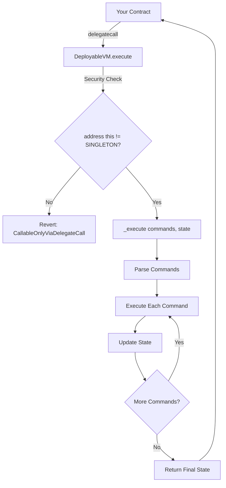

# Architecture

The DeployableVM is a lightweight wrapper around Enso Finance's audited Weiroll VM implementation, designed for easy deployment and integration across multiple EVM chains.

## High-Level Architecture

<CardGroup cols={3}>
  <Card title="Base VM" icon="microchip">
    Enso Finance's audited Weiroll VM implementation
  </Card>
  <Card title="DeployableVM" icon="layer-group">
    Thin wrapper adding delegatecall-only security
  </Card>
  <Card title="Singleton" icon="globe">
    Deterministically deployed across chains
  </Card>
</CardGroup>

## Component Overview

### 1. Base VM (Enso Finance)

The foundation is the `WeirollVM` from Enso Finance:

```solidity
import {VM as WeirollVM} from "lib/enso-weiroll/contracts/VM.sol";

contract DeployableVM is WeirollVM {
    // ...
}
```

This base VM provides:
- Command parsing and execution logic
- State management
- Parameter encoding/decoding
- Low-level call handling

<Info>
The base VM is maintained at: [https://github.com/EnsoFinance/enso-weiroll](https://github.com/EnsoFinance/enso-weiroll)
</Info>

### 2. DeployableVM Wrapper

The DeployableVM adds a minimal security layer:

```solidity
// SPDX-License-Identifier: LGPL-3.0-or-later
pragma solidity ^0.8.27;

import {VM as WeirollVM} from "lib/enso-weiroll/contracts/VM.sol";

contract DeployableVM is WeirollVM {
    error CallableOnlyViaDelegateCall();

    address private immutable WEIROLL_SINGLETON;

    constructor() {
        WEIROLL_SINGLETON = address(this);
    }

    function execute(
        bytes32[] calldata commands,
        bytes[] memory state
    ) public payable returns (bytes[] memory) {
        require(
            address(this) != WEIROLL_SINGLETON,
            CallableOnlyViaDelegateCall()
        );
        
        return _execute(commands, state);
    }
}
```

The wrapper is intentionally minimal:
- **31 lines** of Solidity code total
- **1 immutable variable** for the singleton check
- **1 custom error** for clear revert reasons
- **1 public function** that enforces security and delegates to the base VM

<Tip>
The minimal design reduces attack surface and makes the code easy to audit and verify.
</Tip>

## Execution Flow



### Detailed Steps

<Accordion title="1. Delegatecall Initiation">
Your contract calls the DeployableVM via delegatecall:

```solidity
(bool success, bytes memory result) = address(weiVm).delegatecall(
    abi.encodeCall(DeployableVM.execute, (commands, state))
);
```

This causes the VM's code to execute in your contract's context.
</Accordion>

<Accordion title="2. Security Verification">
The `execute` function immediately checks:

```solidity
require(
    address(this) != WEIROLL_SINGLETON,
    CallableOnlyViaDelegateCall()
);
```

If called directly, `address(this)` equals the singleton address and execution reverts.
</Accordion>

<Accordion title="3. Command Execution">
The internal `_execute` function (from base VM) processes each command:

- Decode the command's target, selector, and parameters
- Read input values from the state array
- Execute the encoded function call
- Store return values back into state
- Move to the next command
</Accordion>

<Accordion title="4. State Return">
After all commands execute, the final state array is returned to the caller:

```solidity
return _execute(commands, state);
```

The state now contains all intermediate and final results.
</Accordion>

## Deployment Strategy

The DeployableVM uses deterministic deployment via CREATE2 for consistent addresses across chains.

### Deterministic Deployment

The deployment script uses an empty salt for deterministic addressing:

```solidity
contract DeployableVMScript is Script {
    DeployableVM public weiVm;

    function run() public {
        vm.startBroadcast();
        
        // Use deterministic salt to deploy the contract.
        weiVm = new DeployableVM{salt: ""}();
        
        vm.stopBroadcast();
    }
}
```

<Info>
Using `salt: ""` (empty bytes32) ensures the contract deploys to the same address on any chain when deployed by the same account with the same nonce.
</Info>

### Benefits of Deterministic Deployment

<CardGroup cols={2}>
  <Card title="Consistent Integration" icon="puzzle-piece">
    Your contracts can hard-code the VM address, working across all chains
  </Card>
  <Card title="Simplified Testing" icon="flask">
    Same address in development, staging, and production
  </Card>
  <Card title="Easy Verification" icon="shield-check">
    Community can verify the code matches across all deployments
  </Card>
  <Card title="No Registry Needed" icon="database">
    No need for an on-chain registry of VM addresses
  </Card>
</CardGroup>

### Multi-Chain Deployment

The repository tracks official deployments in `networks.json`:

```bash
# Generate deployment addresses
bash dev/generate-networks-file.sh > networks.json
```

This creates a mapping of chain IDs to deployed VM addresses:

```json
{
  "1": "0x...",      // Ethereum Mainnet
  "10": "0x...",     // Optimism
  "137": "0x...",    // Polygon
  // ...
}
```

<Warning>
**Important**: The project requires a specific Foundry version for deterministic deployment:

```bash
foundryup -C cb9dfae298fe0b5a5cdef2536955f50b8c7f0bf5
```

Different compiler versions may generate different bytecode, resulting in different addresses.
</Warning>

## Storage Layout

The DeployableVM has a minimal storage footprint:

```solidity
address private immutable WEIROLL_SINGLETON;
```

**Immutable variables** are stored in the contract's bytecode, not in storage slots:
- Zero storage slot usage
- No storage collision risks when used via delegatecall
- Gas-efficient reads (part of code, not SLOAD)

<Tip>
Using immutable for the singleton address is a clever design choice - it avoids storage completely while still allowing runtime checks.
</Tip>

## Integration Patterns

### Pattern 1: Direct Integration

Embed Weiroll execution in your contract:

```solidity
contract MyContract {
    address private immutable WEIROLL_VM;
    
    constructor(address weirollVm) {
        WEIROLL_VM = weirollVm;
    }
    
    function executeScript(
        bytes32[] calldata commands,
        bytes[] memory state
    ) external returns (bytes[] memory) {
        (bool success, bytes memory result) = WEIROLL_VM.delegatecall(
            abi.encodeCall(DeployableVM.execute, (commands, state))
        );
        require(success, "Script execution failed");
        return abi.decode(result, (bytes[]));
    }
}
```

### Pattern 2: Modular Execution

Separate script execution from business logic:

```solidity
abstract contract WeirollEnabled {
    address private immutable WEIROLL_VM;
    
    constructor(address weirollVm) {
        WEIROLL_VM = weirollVm;
    }
    
    function _executeWeiroll(
        bytes32[] calldata commands,
        bytes[] memory state
    ) internal returns (bytes[] memory) {
        (bool success, bytes memory result) = WEIROLL_VM.delegatecall(
            abi.encodeCall(DeployableVM.execute, (commands, state))
        );
        require(success, "Weiroll execution failed");
        return abi.decode(result, (bytes[]));
    }
}

contract MyFeature is WeirollEnabled {
    constructor(address weirollVm) WeirollEnabled(weirollVm) {}
    
    function doComplexOperation() external {
        // Build commands...
        bytes[] memory result = _executeWeiroll(commands, state);
        // Process result...
    }
}
```

### Pattern 3: Governance-Controlled

Use Weiroll for governance execution:

```solidity
contract Governance {
    address private immutable WEIROLL_VM;
    
    // Only governance can execute scripts
    function executeGovernanceScript(
        bytes32[] calldata commands,
        bytes[] memory state
    ) external onlyGovernance returns (bytes[] memory) {
        (bool success, bytes memory result) = WEIROLL_VM.delegatecall(
            abi.encodeCall(DeployableVM.execute, (commands, state))
        );
        require(success, "Governance script failed");
        return abi.decode(result, (bytes[]));
    }
}
```

## Performance Characteristics

### Gas Efficiency

The DeployableVM is designed for minimal overhead:

- **Delegatecall cost**: ~100 gas base cost
- **Security check**: ~100 gas (SLOAD of immutable + comparison)
- **Command execution**: Depends on commands (typical: 20k-50k per command)

<Note>
The VM's gas efficiency comes from batching multiple operations and avoiding intermediate token transfers.
</Note>

### Bytecode Size

The DeployableVM is compact:
- Minimal wrapper code
- Base VM is optimized
- Total deployment cost: ~2-3M gas depending on base VM size

## Testing Architecture

The test suite validates core functionality:

```solidity
contract DeployableVMTest is Test {
    DeployableVM public weiVm;

    function setUp() public {
        weiVm = new DeployableVM();
    }

    function test_reverts_if_not_delegatecall() public {
        bytes32[] memory commands = new bytes32[](0);
        bytes[] memory state = new bytes[](0);

        vm.expectRevert(DeployableVM.CallableOnlyViaDelegateCall.selector);
        weiVm.execute(commands, state);
    }

    function test_callable_via_delegatecall() public {
        bytes32[] memory commands = new bytes32[](0);
        bytes[] memory state = new bytes[](0);

        (bool success,) = address(weiVm).delegatecall(
            abi.encodeCall(DeployableVM.execute, (commands, state))
        );
        assertTrue(success);
    }
}
```

Tests cover:
- ✓ Direct call prevention (line 14 in src/DeployableVM.t.sol:14)
- ✓ Delegatecall acceptance (line 22 in src/DeployableVM.t.sol:22)
- ✓ Empty script execution

<Tip>
Run tests with: `forge test`
</Tip>

## Design Rationale

### Why Wrap Instead of Fork?

The DeployableVM wraps rather than forks the base VM because:

1. **Maintainability**: Benefits from upstream security updates and improvements
2. **Simplicity**: Only adds the essential security check
3. **Audits**: Leverages existing audit work on the base VM
4. **Trust**: Uses a proven, battle-tested implementation

<CardGroup cols={2}>
  <Card title="Wrapping (Used)" icon="gift" color="#22c55e">
    ✓ Inherits upstream improvements
    ✓ Minimal custom code to audit
    ✓ Clear separation of concerns
  </Card>
  <Card title="Forking (Not Used)" icon="code-fork" color="#6b7280">
    ✗ Must manually merge updates
    ✗ More code to audit
    ✗ Diverges from upstream
  </Card>
</CardGroup>

### Why Immutable Singleton Address?

Using an immutable variable for the singleton check:

- **Gas efficient**: Immutables are stored in bytecode, not storage
- **No collision**: Doesn't use storage slots that could conflict with delegatecall
- **Simple**: Set once in constructor, immutable forever
- **Secure**: Cannot be modified after deployment

## Summary

The DeployableVM architecture is characterized by:

✅ **Minimal wrapper** over audited base VM
✅ **Deterministic deployment** for consistent multi-chain addresses
✅ **Immutable storage** avoiding delegatecall storage conflicts
✅ **Simple integration** patterns for any contract
✅ **Efficient execution** with low gas overhead

The design prioritizes security, simplicity, and ease of integration while leveraging proven, audited code.
